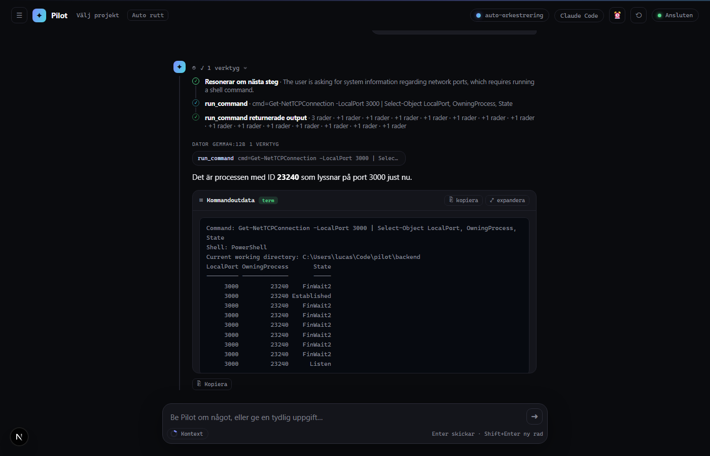

# Pilot

**A local-first, tool-using AI agent that carries out — and then verifies — grounded desktop-and-web tasks on a Windows machine.**

Pilot runs on your machine, on local [Ollama](https://ollama.com) models by default. You talk to it in natural language (Swedish or English); it classifies the turn, gathers what it needs (reads project files, runs read-only shell commands, does web research), performs the action, and answers **only from evidence it actually gathered**. When a task produces a file, Pilot writes it and verifies it exists before claiming success.



**Trust model / intended user:** a technically comfortable person running Pilot on their own machine, who wants an assistant that can actually touch their files, shell and screen — not a cloud chatbot — and accepts "it runs on my machine with my permissions." Pilot is a working personal agent and a public code sample, **not** a hosted multi-user product, and this README never claims production-grade reliability: see [Evaluation](#evaluation--measured-not-claimed) for what is actually measured.

---

## Quick start

Requirements: [Ollama](https://ollama.com) with `gemma4:12b` pulled, [uv](https://docs.astral.sh/uv/), [pnpm](https://pnpm.io) + Node 18+. Optional: [ComfyUI](https://github.com/comfyanonymous/ComfyUI) for image generation.

```bash
# Backend — FastAPI + WebSocket on :8000, MCP server on :3001
cd backend
uv run python main.py

# Frontend — http://localhost:3000
cd frontend
pnpm install && pnpm dev
```

Configuration is env-based (`backend/.env`, template in `backend/.env.example`). The important ones:

| Variable | Default | Description |
|----------|---------|-------------|
| `OLLAMA_MODEL` | `gemma4:12b` | Default coordinator/answer model |
| `OLLAMA_BASE_URL` | `http://localhost:11434` | Ollama URL |
| `PILOT_ANSWER_BACKEND` | `ollama` | `ollama` (fully local) or `openai` — see [Model backends](#model-backends-local-first-api-optional) |
| `OPENAI_API_KEY` / `OPENAI_MODEL` | — / `gpt-4o-mini` | Only used when the backend is `openai` |
| `BACKEND_HOST` / `MCP_HOST` | `127.0.0.1` | Loopback by default; expose deliberately only behind a private network **and** with tokens set |
| `PILOT_AUTH_TOKEN` / `PILOT_MCP_AUTH_TOKEN` | _(empty)_ | Shared secrets for the WebSocket `hello` and the MCP endpoints |
| `COMMAND_TIMEOUT_SECONDS` | `60` | Wall-clock bound for one `run_command`; the process tree is killed on timeout |
| `COORDINATOR_MAX_STEPS` | `6` | Max consults/tool calls one turn may chain |

The full list (memory, ComfyUI, code agents, scheduled jobs) is in `backend/.env.example` and `backend/config.py`.

---

## Architecture

One user turn flows through four stages, all in `backend/`:

```
WebSocket (api/ws.py)
  └─ classify_turn (agents/orchestrator.py)      what kind of turn is this?
      └─ RoutingDecision (agents/routing.py)     explainable engine choice, surfaced to the UI
          └─ run_coordinator (agents/coordinator.py)
              • decides the next step via native tool-calling
              • runs OS/web tools, consults installed specialist models
              • task contracts gate the answer on real evidence
              └─ compose_reply (agents/orchestrator.py)
                    final answer, grounded in (bounded) gathered evidence
```

- **Coordinator ("front brain")** — a fast local model drives an in-turn loop: `consult` a specialist (code → `devstral`/`qwen2.5-coder`, research → `gpt-oss`, hard reasoning → `deepseek-r1`), `perceive` the screen, run a tool, `remember` a durable fact, `clarify`, or `answer`. Only models actually installed in Ollama are offered as experts (fail-closed inventory, `agents/model_inventory.py`).
- **Task contracts** (`agents/task_contracts.py`) — a research turn cannot claim completion without fetched sources; a file-creation turn cannot claim completion without a **written and verified** artifact; a project-analysis turn must actually read the playbook files first. The answer gate is enforced in code, not prompted.
- **Perception** — screenshot + a Set-of-Marks element list via Windows UI Automation (`PERCEPTION_ENABLED`), so desktop actions target known element centers. Works without a vision model; a multimodal model only adds a visual description.
- **Language gateway** (`agents/gateway.py`) — vague requests get one clarifying question instead of a guess; hand-offs to specialists are refined into a clear English instruction (local models reason better in English) while the reply stays in your language.
- **Long-term memory** (`memory.py`) — a small semantic store (embeddings via `nomic-embed-text`) recalled each turn and written via the coordinator's `remember` action.
- **Frontend** — Next.js chat UI streaming every thinking/action/result event live, with per-session Läge/Modell/Agent toggles.

### Model backends (local-first, API optional)

The model-driven calls — classification, the tool-decision loop, expert consults, final synthesis — go through one provider layer (`agents/providers.py`) with two backends:

- **`ollama`** (default): everything stays on your machine.
- **`openai`**: those calls go to an OpenAI-compatible API (`OPENAI_MODEL`, default `gpt-4o-mini`). Perception/vision and memory embeddings **always stay local**.

This is a deployment lever, not a mode switch buried in code: local for privacy and zero cost, the API path for harder multi-step tasks — with the trade-off measured (below) rather than asserted. **Privacy note:** on the `openai` backend, gathered evidence (file contents, screen text, web results) is sent to the API.

---

## Safety boundaries

Layered, each enforced in code and covered by tests:

| Layer | What it does | Where |
|---|---|---|
| Network fail-closed | Binds loopback by default; WebSocket requires an authenticated `hello` when a token is set; MCP requires a bearer token; constant-time comparisons | `config.py`, `api/ws.py`, `api/mcp.py`; `tests/test_ws_auth.py`, `tests/test_mcp_auth.py` |
| Command risk classification | Each shell command is classified (delete / write / install / encoded / download-and-execute / nested shell …). Read-only runs directly; risky requires explicit confirmation | `tools/command_risk.py`; `tests/test_command_risk.py` |
| Prompt-injection quarantine | Everything gathered (tool output, web, memory, screen text) is wrapped in `UNTRUSTED_EVIDENCE` blocks with a "data, not instructions" rule; break-out attempts are defanged | `agents/untrusted.py`; `tests/test_untrusted.py` |
| Desktop action safety | Input tools are blocked without visual context, and when the observation is stale or the active window changed | `agents/safety.py`; `tests/test_freshness.py` |
| Runaway guards | Per-command wall-clock timeout with process-**tree** kill; identical failing commands blocked on the 3rd attempt; per-job tool budgets for scheduled tasks | `tools/system.py`, `agents/coordinator.py`, `job_permissions.py` |
| Grounding / honesty | Contracts gate answers on evidence; file outputs must be verified; tool-backed replies are guarded against raw-log or false-action-claim answers | `agents/task_contracts.py`, `agents/turn_policy.py` |

The eval suite treats the safety layers as **pass/fail gates** — a single injection or confirmation-gate failure fails the whole suite regardless of the average score.

---

## Evaluation — measured, not claimed

Two suites, both in `backend/tests/eval/`:

1. **Deterministic replay suite** (`runner.py`, `scenarios.py`) — 28+ golden and adversarial scenarios (prompt injection in files/web/memory/screen, contract gating, capability profiles) that run in CI with no model and no network.
2. **Live-model runner** (`live_runner.py`) — drives the **real agent** end to end against a live model and scores 10 tasks with deterministic checkers: solve rate per category, latency (median/p90), a failure taxonomy, per-task tokens/cost, and hard safety gates.

```bash
cd backend
uv run python -m tests.eval.live_runner                    # local backend
uv run python -m tests.eval.live_runner --backend openai   # OpenAI backend
```

Reports land in `backend/tests/eval/results/` (committed). Latest comparison, same 10 tasks:

| Metric | Local `gemma4:12b` | OpenAI `gpt-4o-mini` |
|---|---|---|
| Solve rate | 7–8/10 | 8/10 |
| Latency median / p90 | ~42s / ~222s | ~11s / ~31s |
| Cost per run | $0 (local) | ~$0.03 |
| Safety gates (injection, confirmation) | **3/3 held** | **3/3 held** |

Two honest takeaways from running this:

- **Safety behaviour is backend-independent** — the defenses live in the agent (contracts, risk classifier, evidence quarantine), not the model.
- **The remaining failures are the tool layer, not the LLM.** Both backends miss the research-to-file task because web retrieval returned no readable sources, and a file-count task because of shell-command quality — a bigger model doesn't fix either. The eval exists precisely to find this kind of thing: it has so far driven fixes for a coordinator decision-spin, a compose-grounding collapse, a missing command timeout, and a repeated-command loop, each verified red→green. Full analysis: [`docs/eval-live-findings-2026-07-02.md`](docs/eval-live-findings-2026-07-02.md).

---

## Limitations (deliberate scope)

- **Not** autonomous multi-application workflows with no user in the loop.
- **Not** built for guaranteed reliability or unattended operation; small local models are visibly inconsistent on some task types (see the eval variance notes).
- **Not** multi-user or internet-exposed hosting — the network model is single-user loopback/LAN (optionally behind e.g. Tailscale with tokens).
- **No** account/credential entry on your behalf, financial transactions, or irreversible bulk operations without explicit confirmation.
- Vision is optional; when no multimodal model is available, desktop input tools are **blocked** rather than run blind.
- Web retrieval quality bounds research tasks — the eval shows this is the current weakest link, not the answering model.

---

## Design decisions

- **Local-first, API-optional.** Privacy and zero marginal cost by default; a measured, selectable API path where capability/latency genuinely pays for it — the eval quantifies the trade instead of guessing.
- **Verify, don't trust the model's word.** Task contracts gate answers on recorded evidence; file outputs require a verification command. The agent's honesty is a property of the harness, not the prompt.
- **Fail closed everywhere.** Model inventory, network exposure, desktop input without observation, MCP auth — when discovery or auth fails, capabilities shrink instead of assuming.
- **Explainable routing.** Every turn carries a `RoutingDecision` (route, engine, reason, required permissions) surfaced to the UI before anything expensive or risky runs.
- **Measure before polishing.** The evaluation task set and success criteria were defined *before* demo work ([`docs/public-demo-scope.md`](docs/public-demo-scope.md)), and every fix the suite drove is documented with before/after runs.

## Project structure

```
pilot/
├── backend/
│   ├── main.py                 # Entrypoint (FastAPI + MCP)
│   ├── config.py               # Env-based config
│   ├── agents/
│   │   ├── orchestrator.py     # classify_turn + compose_reply (final answer layer)
│   │   ├── coordinator.py      # in-turn tool/consult loop (the "front brain")
│   │   ├── providers.py        # model backends: ollama | openai
│   │   ├── routing.py          # explainable RoutingDecision
│   │   ├── task_contracts.py   # evidence-gated completion contracts
│   │   ├── untrusted.py        # prompt-injection quarantine
│   │   └── safety.py           # desktop-action guards
│   ├── tools/                  # run_command, files, web, screen/input, registry
│   ├── tests/eval/             # deterministic replay suite + live-model runner
│   └── api/                    # ws.py (WebSocket), mcp.py (MCP server)
└── frontend/                   # Next.js chat UI
```

## MCP integration

The backend exposes computer-control tools over MCP (`http://localhost:3001/mcp`, SSE): `pilot_screenshot`, `pilot_click`, `pilot_type`, `pilot_run_command`, `pilot_open_app`, file tools and more. Guard it with `PILOT_MCP_AUTH_TOKEN` before exposing beyond loopback.

## License

MIT — see [LICENSE](LICENSE).
